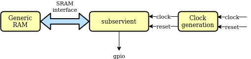

# subservient

Small SERV-based SoC primarily for OpenMPW tapeout

## Introduction

Subservient is a small SoClet around the award-winning SERV, the world's smallest RISC-V CPU intended to be used for ASIC implementations. The SoClet exposes a port intended to be connected to be connected to an SRAM used for both the register file and data/instruction memory and a GPIO pin. The memory is expected to be initialized with a valid application upon release of Subservient reset.

## Architecture

### Top-level

The top-level of Subservient consists of the subservient_core component which contains all the vital SoC infrastructure, and the standard peripheral controllers, currently only consisting of GPIO. This is a convenience wrapper for users who are happy with the standard set of peripherals.

### Subservient core

Subservient core contains SERV and the necessary components to use a single SRAM for SERV's register file, data and instruction memories, all wrapped in the [Servile](https://serv.readthedocs.io/en/latest/reservoir.html#servile-convenience-wrapper) helper component.

### Testbench

Subservient comes with a simple testbench that allows running programs on the simulated SoC and monitor its outputs either as a GPIO or as a UART. Memory is preloaded from a verilog hex file.

## Getting started

Subservient uses [FuseSoC](https://github.com/olofk/fusesoc) to handle its dependencies and run the SoC through different tool flows.

1. Install FuseSoC `pip3 install fusesoc` (Requires at least FuseSoC version 2.4)
2. Create an empty workspace directory and enter it `mkdir workspace && cd workspace`
3. From within your workspace directory add the required FuseSoC libraries
   - Base library `fusesoc library add https://github.com/fusesoc/fusesoc-cores`
   - SERV `fusesoc library add https://github.com/olofk/serv`
   - Subservient `fusesoc library add https://github.com/olofk/subservient`
4. FuseSoC should be able to see the subservient SoC. Verify this by running `fusesoc core show subservient`
5. We can now run a simulation with the simulator we have at hand. `fusesoc run --target=sim_hello --tool=icarus subservient --timeout=4000000` will launch a simulation using Icarus Verilog and printing out a text string twice before exiting. More information about simulations can be found in the simulation section

## FPGA

Subservient can be implemented on an FPGA board for testing. Currently supported board is Nexys A7. For FPGA builds, the memory is expected to be preloaded with an application to run. To build Subservient for the Nexys A7 board, run:

    fusesoc run --target=nexys_a7 subservient

## Simulation

Subservient can be run in a simulator. To use the default simulator (Icarus Verilog) with a preloaded hello world application run:

    fusesoc run --target=sim_hello subservient

Other simulators can be used with the `--tool` option, e.g.

    fusesoc run --target=sim_hello --tool=modelsim subservient

In order to run a custom application, use the `sim` target and supply an application as a Verilog hex file with the `--firmware` option, e.g.:

    fusesoc run --target=sim subservient --firmware=path/to/blinky.hex

## Acknowledgements

[This project](https://nlnet.nl/project/Edalize-ASIC/) has been primarily funded through the [NGI0 PET Fund](https://nlnet.nl/PET/), a fund established by NLnet with financial support from the European Commission's Next Generation Internet programme, under the aegis of DG Communications Networks, Content and Technology under grant agreement No 825310.

